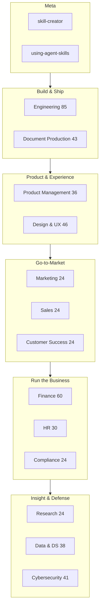

# 🧠 Agent Skills Collection

**Production-ready Agent Skills** for Claude, Codex, Cursor, Gemini CLI, and other AI coding agents.

Built on the [Anthropic Agent Skills standard](https://github.com/anthropics/skills) — progressive disclosure, strong trigger descriptions, verification checklists.

---

## 📊 Collection at a glance

| | |
|:--|--:|
| **Total skills** | **501** |
| **Domains** | 13 + Meta |
| **License** | MIT |
| **Goal** | 500+ ✅ achieved |

```text
┌─────────────────────────────────────────────────────────────┐
│                    AGENT SKILLS COLLECTION                  │
│                         501 skills                          │
├──────────────┬──────────────┬──────────────┬────────────────┤
│ ⚙️ Engineering│ 📄 Documents │ 📦 Product   │ 🎨 Design & UX │
│     85       │     43       │     36       │      46        │
├──────────────┼──────────────┼──────────────┼────────────────┤
│ 📈 Marketing │ 🤝 Sales     │ 💰 Finance   │ 🔬 Research    │
│     24       │     24       │     60       │      24        │
├──────────────┼──────────────┼──────────────┼────────────────┤
│ 🛡️ Compliance│ 💙 Cust. Succ│ 👥 HR        │ 📊 Data & DS   │
│     24       │     24       │     30       │      38        │
├──────────────┴──────────────┴──────────────┼────────────────┤
│ 🔐 Cybersecurity                           │ 🧠 Meta        │
│              41                            │      2         │
└────────────────────────────────────────────┴────────────────┘
```

---

## 🗺️ Domain map

| Icon | Domain | Skills | Folder |
|:----:|--------|:------:|--------|
| 🧠 | [Meta](#-meta-2) | 2 | `skills/meta/` |
| ⚙️ | [Engineering & Software Development](#️-engineering--software-development-85) | 85 | `skills/engineering/` |
| 📄 | [Document Production](#-document-production-43) | 43 | `skills/document-production/` |
| 📦 | [Product Management](#-product-management-36) | 36 | `skills/product-management/` |
| 🎨 | [Design & UX](#-design--ux-46) | 46 | `skills/design-ux/` |
| 📈 | [Marketing & Growth](#-marketing--growth-24) | 24 | `skills/marketing-growth/` |
| 🤝 | [Sales](#-sales-24) | 24 | `skills/sales/` |
| 💰 | [Finance](#-finance-60) | 60 | `skills/finance/` |
| 🔬 | [Research](#-research-24) | 24 | `skills/research/` |
| 🛡️ | [Compliance](#️-compliance-24) | 24 | `skills/compliance/` |
| 💙 | [Customer Success](#-customer-success-24) | 24 | `skills/customer-success/` |
| 👥 | [HR](#-hr-30) | 30 | `skills/hr/` |
| 📊 | [Data Analytics & Data Science](#-data-analytics--data-science-38) | 38 | `skills/data-analytics/` |
| 🔐 | [Cybersecurity](#-cybersecurity-41) | 41 | `skills/cybersecurity/` |

---

## 🧭 How skills fit together



---

## 📚 Skills catalog

> Click each domain below to **expand / collapse** the full skill table.

### 🧠 Meta (2)

| Icon | Skill | Description | Link |
|:----:|-------|-------------|------|
| 🛠️ | **skill-creator** | Create, improve, and evaluate new Agent Skills | [View](skills/meta/skill-creator/) |
| 🧭 | **using-agent-skills** | Discover and apply the right skills for the task | [View](skills/meta/using-agent-skills/) |

---

### 🔐 Cybersecurity (41)

<details>
<summary><strong>▶️ Click to expand Cybersecurity catalog</strong></summary>

<br>

#### Red team & offensive methodology

| Icon | Skill | Description | Link |
|:----:|-------|-------------|------|
| 🎭 | **adversary-emulation** | CTI-driven ATT&CK TTP emulation | [View](skills/cybersecurity/adversary-emulation/) |
| 📋 | **rules-of-engagement** | Scope, safety stops, deconfliction | [View](skills/cybersecurity/rules-of-engagement/) |
| 🏦 | **tiber-style-tlpt** | Intelligence-led critical-function TLPT | [View](skills/cybersecurity/tiber-style-tlpt/) |
| 🛤️ | **attack-path-analysis** | Entry → impact path prioritization | [View](skills/cybersecurity/attack-path-analysis/) |
| 🗺️ | **detection-coverage-mapping** | ATT&CK coverage heatmaps & gaps | [View](skills/cybersecurity/detection-coverage-mapping/) |
| 🔴 | **red-team-basics** | Adversary simulation programs | [View](skills/cybersecurity/red-team-basics/) |
| 🟣 | **purple-teaming** | Collaborative detection improvement | [View](skills/cybersecurity/purple-teaming/) |
| 🎯 | **penetration-testing-basics** | Scope, consume, remediate tests | [View](skills/cybersecurity/penetration-testing-basics/) |
| 🛰️ | **detection-engineering** | High-signal detections as a product | [View](skills/cybersecurity/detection-engineering/) |
| 🔬 | **forensics-basics** | Evidence preservation & analysis | [View](skills/cybersecurity/forensics-basics/) |
| 🎭 | **tabletop-exercises** | Practice decisions before crisis | [View](skills/cybersecurity/tabletop-exercises/) |

#### Core defensive & platform security

| Icon | Skill | Link |
|:----:|-------|------|
| 🛡️ | security-fundamentals | [View](skills/cybersecurity/security-fundamentals/) |
| 🗺️ | threat-modeling-security | [View](skills/cybersecurity/threat-modeling-security/) |
| 🩹 | vulnerability-management | [View](skills/cybersecurity/vulnerability-management/) |
| 🔑 | identity-and-access-management | [View](skills/cybersecurity/identity-and-access-management/) |
| 🌐 | network-security-basics | [View](skills/cybersecurity/network-security-basics/) |
| 📦 | application-security | [View](skills/cybersecurity/application-security/) |
| 💻 | secure-coding | [View](skills/cybersecurity/secure-coding/) |
| 🔐 | secrets-and-credential-hygiene | [View](skills/cybersecurity/secrets-and-credential-hygiene/) |
| 📡 | security-logging-and-monitoring | [View](skills/cybersecurity/security-logging-and-monitoring/) |
| 🚨 | incident-response | [View](skills/cybersecurity/incident-response/) |
| 💻 | endpoint-security | [View](skills/cybersecurity/endpoint-security/) |
| 🎣 | phishing-and-social-engineering | [View](skills/cybersecurity/phishing-and-social-engineering/) |
| ☁️ | cloud-security | [View](skills/cybersecurity/cloud-security/) |
| 🐳 | container-and-kubernetes-security | [View](skills/cybersecurity/container-and-kubernetes-security/) |
| 🚫 | zero-trust-architecture | [View](skills/cybersecurity/zero-trust-architecture/) |
| 🔒 | encryption-and-key-management | [View](skills/cybersecurity/encryption-and-key-management/) |
| 🏛️ | security-architecture | [View](skills/cybersecurity/security-architecture/) |
| 📚 | security-awareness-programs | [View](skills/cybersecurity/security-awareness-programs/) |
| 🤝 | third-party-security | [View](skills/cybersecurity/third-party-security/) |
| 📎 | supply-chain-security-cyber | [View](skills/cybersecurity/supply-chain-security-cyber/) |
| 💾 | backup-and-recovery-security | [View](skills/cybersecurity/backup-and-recovery-security/) |
| 📊 | security-metrics-and-reporting | [View](skills/cybersecurity/security-metrics-and-reporting/) |
| 📢 | vulnerability-disclosure | [View](skills/cybersecurity/vulnerability-disclosure/) |
| 🦠 | ransomware-readiness | [View](skills/cybersecurity/ransomware-readiness/) |
| 📧 | email-security | [View](skills/cybersecurity/email-security/) |
| 🔌 | api-security | [View](skills/cybersecurity/api-security/) |
| 📱 | mobile-security | [View](skills/cybersecurity/mobile-security/) |
| 🏭 | ot-ics-security-basics | [View](skills/cybersecurity/ot-ics-security-basics/) |
| 📄 | security-policy-and-standards | [View](skills/cybersecurity/security-policy-and-standards/) |
| 🚫 | data-loss-prevention | [View](skills/cybersecurity/data-loss-prevention/) |

</details>

---

### 📊 Data Analytics & Data Science (38)

<details>
<summary><strong>▶️ Click to expand Data Analytics & DS catalog</strong></summary>

<br>

#### Data governance & quality

| Icon | Skill | Link |
|:----:|-------|------|
| 🏛️ | data-governance | [View](skills/data-analytics/data-governance/) |
| ✅ | data-quality-management | [View](skills/data-analytics/data-quality-management/) |
| 🛡️ | data-quality-monitoring | [View](skills/data-analytics/data-quality-monitoring/) |
| 📚 | data-catalog-and-discovery | [View](skills/data-analytics/data-catalog-and-discovery/) |
| 🔗 | data-lineage | [View](skills/data-analytics/data-lineage/) |
| 🗃️ | master-data-management | [View](skills/data-analytics/master-data-management/) |
| 👤 | data-stewardship | [View](skills/data-analytics/data-stewardship/) |
| 🏷️ | metadata-management | [View](skills/data-analytics/metadata-management/) |
| 📜 | data-contracts | [View](skills/data-analytics/data-contracts/) |

#### Analytics, stats, modeling & ML

| Icon | Skill | Link |
|:----:|-------|------|
| 🎯 | analytics-problem-framing | [View](skills/data-analytics/analytics-problem-framing/) |
| 🔍 | exploratory-data-analysis | [View](skills/data-analytics/exploratory-data-analysis/) |
| 🧹 | data-cleaning | [View](skills/data-analytics/data-cleaning/) |
| 📈 | statistical-analysis | [View](skills/data-analytics/statistical-analysis/) |
| 🧪 | hypothesis-testing | [View](skills/data-analytics/hypothesis-testing/) |
| ⚗️ | experiment-design-data | [View](skills/data-analytics/experiment-design-data/) |
| 📉 | regression-analysis | [View](skills/data-analytics/regression-analysis/) |
| 🏷️ | classification-basics | [View](skills/data-analytics/classification-basics/) |
| 🧩 | clustering-and-segmentation | [View](skills/data-analytics/clustering-and-segmentation/) |
| ⏱️ | time-series-basics | [View](skills/data-analytics/time-series-basics/) |
| 📊 | data-visualization | [View](skills/data-analytics/data-visualization/) |
| 📐 | metrics-definition | [View](skills/data-analytics/metrics-definition/) |
| 🗃️ | sql-for-analysis | [View](skills/data-analytics/sql-for-analysis/) |
| 🔧 | feature-engineering | [View](skills/data-analytics/feature-engineering/) |
| ✅ | model-evaluation | [View](skills/data-analytics/model-evaluation/) |
| 🔎 | feature-importance-and-explainability | [View](skills/data-analytics/feature-importance-and-explainability/) |
| 🔮 | forecasting | [View](skills/data-analytics/forecasting/) |
| 🚨 | anomaly-detection | [View](skills/data-analytics/anomaly-detection/) |
| ⛓️ | causal-inference-basics | [View](skills/data-analytics/causal-inference-basics/) |
| 🏗️ | analytics-engineering | [View](skills/data-analytics/analytics-engineering/) |
| 📱 | dashboard-design | [View](skills/data-analytics/dashboard-design/) |
| 🗣️ | storytelling-with-data | [View](skills/data-analytics/storytelling-with-data/) |
| ⚙️ | mlops-basics | [View](skills/data-analytics/mlops-basics/) |
| 📝 | nlp-basics | [View](skills/data-analytics/nlp-basics/) |
| 🎁 | recommendation-basics | [View](skills/data-analytics/recommendation-basics/) |
| ⚖️ | data-ethics | [View](skills/data-analytics/data-ethics/) |
| 📓 | notebook-best-practices | [View](skills/data-analytics/notebook-best-practices/) |
| 🎲 | sampling-and-bias | [View](skills/data-analytics/sampling-and-bias/) |
| 📑 | ab-test-analysis | [View](skills/data-analytics/ab-test-analysis/) |

</details>

---

### 👥 HR (30)

<details>
<summary><strong>▶️ Click to expand HR catalog</strong></summary>

<br>

| Icon | Skill | Link |
|:----:|-------|------|
| 🎯 | talent-acquisition | [View](skills/hr/talent-acquisition/) |
| 🏗️ | job-architecture | [View](skills/hr/job-architecture/) |
| 🎙️ | interviewing | [View](skills/hr/interviewing/) |
| 🚀 | onboarding-hr | [View](skills/hr/onboarding-hr/) |
| 📊 | performance-management | [View](skills/hr/performance-management/) |
| 🎯 | goal-setting-and-okrs-hr | [View](skills/hr/goal-setting-and-okrs-hr/) |
| 💬 | feedback-and-coaching | [View](skills/hr/feedback-and-coaching/) |
| 📚 | learning-and-development | [View](skills/hr/learning-and-development/) |
| 👑 | succession-planning | [View](skills/hr/succession-planning/) |
| 💰 | compensation-design | [View](skills/hr/compensation-design/) |
| 🏥 | benefits-strategy | [View](skills/hr/benefits-strategy/) |
| 📈 | workforce-planning | [View](skills/hr/workforce-planning/) |
| ⚖️ | employee-relations | [View](skills/hr/employee-relations/) |
| 💙 | employee-engagement | [View](skills/hr/employee-engagement/) |
| 🌈 | diversity-equity-inclusion | [View](skills/hr/diversity-equity-inclusion/) |
| 🏛️ | culture-and-values | [View](skills/hr/culture-and-values/) |
| 📄 | hr-policies | [View](skills/hr/hr-policies/) |
| 🔍 | workplace-investigations | [View](skills/hr/workplace-investigations/) |
| 🚪 | offboarding | [View](skills/hr/offboarding/) |
| 🔄 | internal-mobility | [View](skills/hr/internal-mobility/) |
| 📉 | hr-analytics | [View](skills/hr/hr-analytics/) |
| 🖥️ | hr-systems | [View](skills/hr/hr-systems/) |
| ⚖️ | labor-compliance-basics | [View](skills/hr/labor-compliance-basics/) |
| 🧭 | manager-enablement | [View](skills/hr/manager-enablement/) |
| 🎁 | total-rewards | [View](skills/hr/total-rewards/) |
| 📣 | employer-branding | [View](skills/hr/employer-branding/) |
| 🔀 | change-management-hr | [View](skills/hr/change-management-hr/) |
| 🧘 | wellbeing-and-burnout | [View](skills/hr/wellbeing-and-burnout/) |
| 🗂️ | org-design-basics | [View](skills/hr/org-design-basics/) |
| 🤝 | hrbp-partnership | [View](skills/hr/hrbp-partnership/) |

</details>

---

### 💰 Finance (60)

<details>
<summary><strong>▶️ Click to expand Finance catalog</strong></summary>

<br>

| Icon | Skill | Link |
|:----:|-------|------|
| 📑 | financial-statements | [View](skills/finance/financial-statements/) |
| 📊 | financial-modeling | [View](skills/finance/financial-modeling/) |
| 📅 | fpa-and-budgeting | [View](skills/finance/fpa-and-budgeting/) |
| 💵 | cash-flow-management | [View](skills/finance/cash-flow-management/) |
| 💎 | valuation | [View](skills/finance/valuation/) |
| 🧮 | unit-economics | [View](skills/finance/unit-economics/) |
| 🏷️ | pricing-finance | [View](skills/finance/pricing-finance/) |
| 📉 | variance-analysis | [View](skills/finance/variance-analysis/) |
| 🎯 | kpi-and-metrics | [View](skills/finance/kpi-and-metrics/) |
| 🏛️ | capital-structure | [View](skills/finance/capital-structure/) |
| 📝 | investment-appraisal | [View](skills/finance/investment-appraisal/) |
| ⚖️ | break-even-and-contribution | [View](skills/finance/break-even-and-contribution/) |
| 📚 | accounting-basics | [View](skills/finance/accounting-basics/) |
| 🧾 | revenue-recognition | [View](skills/finance/revenue-recognition/) |
| 💳 | expense-management | [View](skills/finance/expense-management/) |
| 🗓️ | month-end-close | [View](skills/finance/month-end-close/) |
| 📋 | management-reporting | [View](skills/finance/management-reporting/) |
| 👔 | board-financial-reporting | [View](skills/finance/board-financial-reporting/) |
| 🏦 | treasury-operations | [View](skills/finance/treasury-operations/) |
| 🔄 | working-capital | [View](skills/finance/working-capital/) |
| 📜 | debt-management | [View](skills/finance/debt-management/) |
| 🤝 | banking-relationships | [View](skills/finance/banking-relationships/) |
| 💱 | fx-and-currency | [View](skills/finance/fx-and-currency/) |
| 🔐 | financial-controls | [View](skills/finance/financial-controls/) |
| 🧾 | tax-fundamentals | [View](skills/finance/tax-fundamentals/) |
| 🌍 | transfer-pricing-basics | [View](skills/finance/transfer-pricing-basics/) |
| ✅ | audit-readiness | [View](skills/finance/audit-readiness/) |
| 🔍 | internal-audit-basics | [View](skills/finance/internal-audit-basics/) |
| ⚠️ | financial-risk-management | [View](skills/finance/financial-risk-management/) |
| 👤 | credit-risk-basics | [View](skills/finance/credit-risk-basics/) |
| 👥 | retail-credit-risk-monitoring | [View](skills/finance/retail-credit-risk-monitoring/) |
| 🏢 | corporate-credit-risk-monitoring | [View](skills/finance/corporate-credit-risk-monitoring/) |
| 🚨 | credit-early-warning-systems | [View](skills/finance/credit-early-warning-systems/) |
| 📊 | credit-portfolio-monitoring | [View](skills/finance/credit-portfolio-monitoring/) |
| 🧪 | scenario-and-stress-testing | [View](skills/finance/scenario-and-stress-testing/) |
| 🚀 | fundraising-finance | [View](skills/finance/fundraising-finance/) |
| 📣 | investor-reporting | [View](skills/finance/investor-reporting/) |
| 🧩 | cap-table-management | [View](skills/finance/cap-table-management/) |
| 📈 | saas-metrics | [View](skills/finance/saas-metrics/) |
| 👥 | cohort-and-retention-finance | [View](skills/finance/cohort-and-retention-finance/) |
| 🏢 | ma-due-diligence | [View](skills/finance/ma-due-diligence/) |
| 📦 | purchase-accounting-basics | [View](skills/finance/purchase-accounting-basics/) |
| 🏭 | cost-accounting | [View](skills/finance/cost-accounting/) |
| 📦 | inventory-accounting | [View](skills/finance/inventory-accounting/) |
| 📝 | lease-accounting-basics | [View](skills/finance/lease-accounting-basics/) |
| 👷 | payroll-finance | [View](skills/finance/payroll-finance/) |
| 🛒 | procurement-to-pay | [View](skills/finance/procurement-to-pay/) |
| 📦 | order-to-cash | [View](skills/finance/order-to-cash/) |
| 🖥️ | financial-systems | [View](skills/finance/financial-systems/) |
| 🧬 | data-quality-finance | [View](skills/finance/data-quality-finance/) |
| 🌱 | esg-and-sustainability-finance | [View](skills/finance/esg-and-sustainability-finance/) |
| 🎗️ | nonprofit-and-fund-accounting-basics | [View](skills/finance/nonprofit-and-fund-accounting-basics/) |
| 👤 | personal-finance-for-founders | [View](skills/finance/personal-finance-for-founders/) |
| ⏱️ | startup-runway | [View](skills/finance/startup-runway/) |
| 🔗 | revenue-operations-finance | [View](skills/finance/revenue-operations-finance/) |
| 💼 | commission-accounting | [View](skills/finance/commission-accounting/) |
| ⏳ | deferred-revenue-management | [View](skills/finance/deferred-revenue-management/) |
| 🗣️ | financial-storytelling | [View](skills/finance/financial-storytelling/) |
| 📊 | benchmark-and-peer-analysis | [View](skills/finance/benchmark-and-peer-analysis/) |
| ⚡ | close-acceleration | [View](skills/finance/close-acceleration/) |

</details>

---

### 💙 Customer Success (24)

<details>
<summary><strong>▶️ Click to expand Customer Success catalog</strong></summary>

<br>

| Icon | Skill | Link |
|:----:|-------|------|
| 🎯 | cs-strategy | [View](skills/customer-success/cs-strategy/) |
| 🚀 | onboarding-success | [View](skills/customer-success/onboarding-success/) |
| 💚 | customer-health-scores | [View](skills/customer-success/customer-health-scores/) |
| 🔄 | renewal-management | [View](skills/customer-success/renewal-management/) |
| 📈 | expansion-playbooks | [View](skills/customer-success/expansion-playbooks/) |
| 🛡️ | churn-prevention | [View](skills/customer-success/churn-prevention/) |
| 📊 | qbr-and-ebis | [View](skills/customer-success/qbr-and-ebis/) |
| ⭐ | customer-advocacy | [View](skills/customer-success/customer-advocacy/) |
| 📋 | success-planning | [View](skills/customer-success/success-planning/) |
| 🔗 | support-to-success-handoff | [View](skills/customer-success/support-to-success-handoff/) |
| 📉 | cs-metrics | [View](skills/customer-success/cs-metrics/) |
| 🗣️ | voice-of-customer | [View](skills/customer-success/voice-of-customer/) |
| 📶 | adoption-programs | [View](skills/customer-success/adoption-programs/) |
| 🎓 | customer-education | [View](skills/customer-success/customer-education/) |
| 📱 | digital-cs | [View](skills/customer-success/digital-cs/) |
| 🚨 | escalation-management | [View](skills/customer-success/escalation-management/) |
| 🗺️ | journey-orchestration | [View](skills/customer-success/journey-orchestration/) |
| 👥 | csm-capacity-planning | [View](skills/customer-success/csm-capacity-planning/) |
| 📕 | at-risk-playbooks | [View](skills/customer-success/at-risk-playbooks/) |
| 💎 | value-realization | [View](skills/customer-success/value-realization/) |
| 🔧 | professional-services-alignment | [View](skills/customer-success/professional-services-alignment/) |
| 🏘️ | community-led-success | [View](skills/customer-success/community-led-success/) |
| 🔁 | customer-feedback-loops | [View](skills/customer-success/customer-feedback-loops/) |
| 🛠️ | cs-tooling | [View](skills/customer-success/cs-tooling/) |

</details>

---

### 🛡️ Compliance (24)

<details>
<summary><strong>▶️ Click to expand Compliance catalog</strong></summary>

<br>

| Icon | Skill | Link |
|:----:|-------|------|
| 📜 | regulatory-compliance | [View](skills/compliance/regulatory-compliance/) |
| 📄 | policy-management | [View](skills/compliance/policy-management/) |
| 🎯 | compliance-risk-assessment | [View](skills/compliance/compliance-risk-assessment/) |
| 🔒 | data-privacy-compliance | [View](skills/compliance/data-privacy-compliance/) |
| 🏦 | aml-kyc-basics | [View](skills/compliance/aml-kyc-basics/) |
| 🔐 | information-security-compliance | [View](skills/compliance/information-security-compliance/) |
| 📊 | sox-and-financial-controls | [View](skills/compliance/sox-and-financial-controls/) |
| 🔍 | compliance-monitoring | [View](skills/compliance/compliance-monitoring/) |
| 🤝 | third-party-risk-compliance | [View](skills/compliance/third-party-risk-compliance/) |
| 📡 | regulatory-change-management | [View](skills/compliance/regulatory-change-management/) |
| 🎓 | compliance-training | [View](skills/compliance/compliance-training/) |
| ⚖️ | ethics-and-conduct | [View](skills/compliance/ethics-and-conduct/) |
| 🚫 | sanctions-screening | [View](skills/compliance/sanctions-screening/) |
| 🧠 | model-risk-governance | [View](skills/compliance/model-risk-governance/) |
| 🛡️ | consumer-protection-compliance | [View](skills/compliance/consumer-protection-compliance/) |
| 📁 | records-management | [View](skills/compliance/records-management/) |
| 📋 | regulatory-exam-management | [View](skills/compliance/regulatory-exam-management/) |
| 🤖 | ai-model-compliance | [View](skills/compliance/ai-model-compliance/) |
| 🚨 | incident-breach-notification | [View](skills/compliance/incident-breach-notification/) |
| 📨 | complaints-handling | [View](skills/compliance/complaints-handling/) |
| ⚠️ | conduct-risk | [View](skills/compliance/conduct-risk/) |
| 📑 | licensing-and-permissions | [View](skills/compliance/licensing-and-permissions/) |
| 🏗️ | operational-resilience-compliance | [View](skills/compliance/operational-resilience-compliance/) |
| 📢 | whistleblowing-investigations | [View](skills/compliance/whistleblowing-investigations/) |

</details>

---

### 🔬 Research (24)

<details>
<summary><strong>▶️ Click to expand Research catalog</strong></summary>

<br>

| Icon | Skill | Link |
|:----:|-------|------|
| 📐 | research-design | [View](skills/research/research-design/) |
| 📚 | literature-review | [View](skills/research/literature-review/) |
| 🖥️ | desk-research | [View](skills/research/desk-research/) |
| 💬 | qualitative-research | [View](skills/research/qualitative-research/) |
| 📊 | quantitative-research | [View](skills/research/quantitative-research/) |
| 📋 | survey-design | [View](skills/research/survey-design/) |
| 🎙️ | interview-research | [View](skills/research/interview-research/) |
| 🧩 | research-synthesis | [View](skills/research/research-synthesis/) |
| 🏁 | competitive-research | [View](skills/research/competitive-research/) |
| 📈 | market-research | [View](skills/research/market-research/) |
| ⚖️ | research-ethics | [View](skills/research/research-ethics/) |
| 📝 | research-reporting | [View](skills/research/research-reporting/) |
| 👀 | ethnographic-research | [View](skills/research/ethnographic-research/) |
| 📔 | diary-studies | [View](skills/research/diary-studies/) |
| 🧪 | usability-research | [View](skills/research/usability-research/) |
| 📉 | experiment-analysis | [View](skills/research/experiment-analysis/) |
| 📖 | systematic-review | [View](skills/research/systematic-review/) |
| 🎯 | jtbd-research | [View](skills/research/jtbd-research/) |
| 🛰️ | technology-scouting | [View](skills/research/technology-scouting/) |
| 🗄️ | secondary-data-analysis | [View](skills/research/secondary-data-analysis/) |
| ⚙️ | research-ops | [View](skills/research/research-ops/) |
| 👤 | persona-evidence | [View](skills/research/persona-evidence/) |
| 💡 | concept-testing | [View](skills/research/concept-testing/) |
| 🌍 | field-research | [View](skills/research/field-research/) |

</details>

---

### 🤝 Sales (24)

<details>
<summary><strong>▶️ Click to expand Sales catalog</strong></summary>

<br>

| Icon | Skill | Link |
|:----:|-------|------|
| 🎯 | sales-strategy | [View](skills/sales/sales-strategy/) |
| 🔍 | discovery-calls | [View](skills/sales/discovery-calls/) |
| 🖥️ | demo-and-presentation | [View](skills/sales/demo-and-presentation/) |
| 🛡️ | objection-handling | [View](skills/sales/objection-handling/) |
| 📝 | proposal-and-negotiation | [View](skills/sales/proposal-and-negotiation/) |
| 📊 | pipeline-management | [View](skills/sales/pipeline-management/) |
| 📚 | sales-enablement | [View](skills/sales/sales-enablement/) |
| 🏢 | account-management | [View](skills/sales/account-management/) |
| 📤 | outbound-prospecting | [View](skills/sales/outbound-prospecting/) |
| ✅ | inbound-qualification | [View](skills/sales/inbound-qualification/) |
| 📖 | sales-playbooks | [View](skills/sales/sales-playbooks/) |
| 📈 | win-loss-analysis | [View](skills/sales/win-loss-analysis/) |
| 📋 | meddicc-qualification | [View](skills/sales/meddicc-qualification/) |
| 🗺️ | mutual-action-plans | [View](skills/sales/mutual-action-plans/) |
| 💵 | pricing-conversations | [View](skills/sales/pricing-conversations/) |
| ⚔️ | competitive-selling | [View](skills/sales/competitive-selling/) |
| 🏛️ | enterprise-deals | [View](skills/sales/enterprise-deals/) |
| 🎓 | sales-coaching | [View](skills/sales/sales-coaching/) |
| 🗄️ | crm-hygiene | [View](skills/sales/crm-hygiene/) |
| 🎯 | forecast-accuracy | [View](skills/sales/forecast-accuracy/) |
| 🤝 | channel-partner-sales | [View](skills/sales/channel-partner-sales/) |
| 🔄 | renewal-and-upsell | [View](skills/sales/renewal-and-upsell/) |
| 💼 | social-selling | [View](skills/sales/social-selling/) |
| 💰 | sales-compensation-basics | [View](skills/sales/sales-compensation-basics/) |

</details>

---

### 📈 Marketing & Growth (24)

<details>
<summary><strong>▶️ Click to expand Marketing & Growth catalog</strong></summary>

<br>

| Icon | Skill | Link |
|:----:|-------|------|
| 📍 | positioning-and-messaging | [View](skills/marketing-growth/positioning-and-messaging/) |
| 📝 | content-marketing | [View](skills/marketing-growth/content-marketing/) |
| 🔍 | seo | [View](skills/marketing-growth/seo/) |
| ✉️ | email-marketing | [View](skills/marketing-growth/email-marketing/) |
| 📱 | social-media-marketing | [View](skills/marketing-growth/social-media-marketing/) |
| 💰 | paid-acquisition | [View](skills/marketing-growth/paid-acquisition/) |
| 🎯 | conversion-optimization | [View](skills/marketing-growth/conversion-optimization/) |
| 🏷️ | brand-strategy | [View](skills/marketing-growth/brand-strategy/) |
| 🚀 | launch-marketing | [View](skills/marketing-growth/launch-marketing/) |
| 📊 | marketing-analytics | [View](skills/marketing-growth/marketing-analytics/) |
| 👥 | customer-segmentation | [View](skills/marketing-growth/customer-segmentation/) |
| 🧪 | growth-experimentation | [View](skills/marketing-growth/growth-experimentation/) |
| ✍️ | copywriting | [View](skills/marketing-growth/copywriting/) |
| 📄 | landing-pages | [View](skills/marketing-growth/landing-pages/) |
| 🔗 | referral-programs | [View](skills/marketing-growth/referral-programs/) |
| 🏘️ | community-marketing | [View](skills/marketing-growth/community-marketing/) |
| 📰 | pr-and-comms | [View](skills/marketing-growth/pr-and-comms/) |
| ⭐ | influencer-marketing | [View](skills/marketing-growth/influencer-marketing/) |
| 🔄 | lifecycle-marketing | [View](skills/marketing-growth/lifecycle-marketing/) |
| 🤝 | partnership-marketing | [View](skills/marketing-growth/partnership-marketing/) |
| 🎤 | webinar-and-events | [View](skills/marketing-growth/webinar-and-events/) |
| 🕵️ | competitive-intelligence | [View](skills/marketing-growth/competitive-intelligence/) |
| 📣 | demand-generation | [View](skills/marketing-growth/demand-generation/) |
| 💚 | retention-marketing | [View](skills/marketing-growth/retention-marketing/) |

</details>

---

### 🎨 Design & UX (46)

<details>
<summary><strong>▶️ Click to expand Design & UX catalog</strong></summary>

<br>

Browse all skills under [`skills/design-ux/`](skills/design-ux/) — including design-systems, ui-design, interaction-design, usability-testing, accessibility-design, design-tokens, mobile-ux, dashboard-ux, form-ux, and 37 more.

</details>

---

### 📦 Product Management (36)

<details>
<summary><strong>▶️ Click to expand Product Management catalog</strong></summary>

<br>

Browse all skills under [`skills/product-management/`](skills/product-management/) — including product-strategy, prioritization-frameworks, roadmap-planning, prd-writing, metrics-and-kpis, jobs-to-be-done, product-market-fit, and more.

</details>

---

### 📄 Document Production (43)

<details>
<summary><strong>▶️ Click to expand Document Production catalog</strong></summary>

<br>

Browse all skills under [`skills/document-production/`](skills/document-production/) — including **docx**, **pptx**, **xlsx**, **pdf**, report-generation, proposal-writing, pitch-deck, board-pack, and specialized document types.

</details>

---

### ⚙️ Engineering & Software Development (85)

<details>
<summary><strong>▶️ Click to expand Engineering catalog</strong></summary>

<br>

Browse all skills under [`skills/engineering/`](skills/engineering/) — covering code review, TDD, security hardening, architecture, CI/CD, observability, microservices, platform engineering, threat modeling, and 75+ more engineering practices.

</details>

---

## 🚀 How to use

```bash
git clone https://github.com/itsual/agent-skills-collection.git
cd agent-skills-collection

# Copy selected skills into your agent skills directory, e.g.:
# Claude: ~/.claude/skills/
# Or symlink individual skill folders
```

Each skill is a folder with a `SKILL.md` (YAML frontmatter + instructions + verification checklist).

---

## 📁 Repository structure

```text
agent-skills-collection/
├── README.md
├── LICENSE
└── skills/
    ├── meta/                 #  2
    ├── engineering/          # 85
    ├── document-production/  # 43
    ├── product-management/   # 36
    ├── design-ux/            # 46
    ├── marketing-growth/     # 24
    ├── sales/                # 24
    ├── finance/              # 60
    ├── research/             # 24
    ├── compliance/           # 24
    ├── customer-success/     # 24
    ├── hr/                   # 30
    ├── data-analytics/       # 38
    └── cybersecurity/        # 41
```

---

## 🛣️ Roadmap

- [x] Engineering · Documents · Product · Design · Marketing · Sales
- [x] Finance · Research · Compliance · Customer Success · HR
- [x] Data Analytics & DS (incl. governance) · Cybersecurity (incl. red team methods)
- [x] **500+ skills milestone**
- [ ] Curated “packs” by persona (e.g. Banking Risk, Startup GTM)
- [ ] Evaluation harness for skill quality

---

## 📄 License

MIT

**Maintained by** [Arockia Liborious](https://github.com/itsual) · **Repo** [itsual/agent-skills-collection](https://github.com/itsual/agent-skills-collection)
